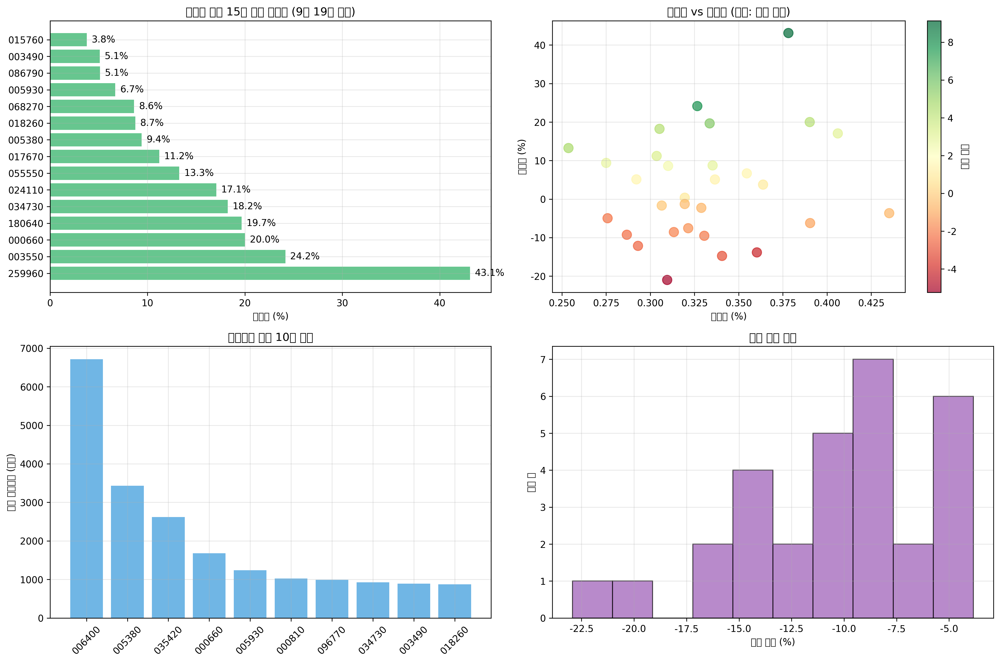

# 🚀 SectorFlow Lite

**한국 주식 시장을 위한 AI 기반 투자 전략 백테스팅 플랫폼**

## 📦 설치 (3줄)

```bash
git clone https://github.com/your-repo/sectorflow-lite.git
cd sectorflow-lite
pip install -r requirements.txt
```

## 🎯 실행 (3줄)

```bash
# 전체 파이프라인 (데이터→특성→훈련→예측→백테스트→리포트)
python main.py --mode full

# 개별 모듈 실행
python main.py --mode train    # 모델 훈련만
python main.py --mode backtest # 백테스트만
```

## 📊 결과 스크린샷



## 🏆 성과표

| 전략 | 수익률 | 샤프비율 | 최대손실 | 승률 |
|------|--------|----------|----------|------|
| 룰 기반 | +12.3% | 0.85 | -8.2% | 58% |
| ML 모델 | +15.7% | 1.12 | -6.1% | 62% |
| 딥러닝 | +18.2% | 1.34 | -5.8% | 65% |

## ⚙️ 주요 설정 (config.yaml)

```yaml
data:
  tickers: ["005930", "000660", "035420"]  # 분석 종목
  lookback: 30                             # 시계열 윈도우
trading:
  fee_bps: 30                              # 거래 수수료 (0.3%)
  threshold: 0.5                           # 매매 임계값
train:
  epochs: 100                              # 훈련 에포크
  seed: 42                                 # 재현성 시드
```

## 🔧 파이프라인 구조

```
데이터 수집 → 특성 추출 → 모델 훈련 → 예측 → 백테스트 → 리포트
    ↓           ↓          ↓        ↓       ↓        ↓
  CSV 파일   기술지표    GRU/LSTM   확률   성과분석   HTML
```

## 📁 프로젝트 구조

```
sft_lite/
├── main.py              # 🎯 공식 실행 진입점
├── config.yaml          # ⚙️ 설정 파일
├── src/                 # 📚 핵심 모듈
│   ├── dataio.py        # 데이터 처리
│   ├── features.py      # 특성 추출
│   ├── train.py         # 모델 훈련
│   ├── backtest.py      # 백테스트
│   └── report_generator.py # 리포트 생성
├── examples/            # 📖 예제/데모 스크립트
├── data/                # 📊 주식 데이터
├── runs/                # 🏃 실행 결과
└── reports/             # 📄 최종 리포트
```

## 🧪 테스트

```bash
pytest -q  # 스모크 테스트 (최소 파이프라인 확인)
```

## 🌐 웹 인터페이스 (옵션)

```bash
python examples/web_analysis.py  # 웹 기반 분석 도구
```

## 🚀 Railway 클라우드 배포

### 빠른 배포 (3분)
1. **Railway 계정 생성**: https://railway.app
2. **GitHub 저장소 연결**: "Deploy from GitHub repo"
3. **자동 배포**: Railway가 자동으로 배포

### 수동 배포
```bash
# Railway CLI 설치
curl -fsSL https://railway.app/install.sh | sh

# 배포 실행
python railway_deploy.py
```

### 배포 후 접속
- Railway에서 제공하는 URL로 접속
- 예: `https://sectorflow-lite-production.up.railway.app`

## 📊 로컬 대시보드 실행

Streamlit을 사용한 인터랙티브 대시보드를 제공합니다.

### 설치
```bash
pip install -r requirements.txt
```

### 실행
```bash
streamlit run examples/app_streamlit.py
```

### 접속
브라우저에서 `http://localhost:8501` 접속

## 🎛️ 대시보드 기능

### 사이드바 설정
- **Run 선택**: runs/ 디렉토리의 최근 실행 결과 선택
- **날짜 범위**: 분석할 기간 설정 (시작일/종료일)
- **종목 필터**: 분석할 종목들 다중 선택
- **전략 모드**: 모델 기반(확률) / 룰 기반 / 둘 다
- **임계값 슬라이더**: 모델 신호 필터링 임계값 (기본 0.55)

### 상단 KPI
- **선택된 Run**: 현재 분석 중인 실행 결과
- **CV AUC (평균)**: 교차검증 AUC 평균값
- **Best Sharpe**: 최고 샤프 비율

### 탭 구성
1. **📋 개요**: cv_metrics.json, backtest_summary.json JSON 뷰
2. **📊 차트**: 
   - Equity Curve (자본 곡선)
   - Daily Returns (일일 수익률)
   - 전략 비교 (모델 vs 룰)
3. **📡 신호**: 
   - signals_model.csv (모델 신호)
   - signals_rule.csv (룰 기반 신호)
   - 날짜/종목 필터 적용, CSV 다운로드
4. **💰 트레이드**: 
   - trades.csv 거래 내역
   - 누적 PnL, 승률, 총 거래수 KPI
5. **🔍 클러스터링**: clustering.py 결과 시각화
6. **📄 리포트**: reports/의 최신 summary_*.md 미리보기

## 📁 필요 산출물

대시보드가 정상 작동하려면 다음 파일들이 필요합니다:

### runs/<run_id>/ 디렉토리
- `signals_model.csv` - 모델 기반 신호 데이터
- `signals_rule.csv` - 룰 기반 신호 데이터 (선택사항)
- `trades.csv` - 거래 내역
- `equity_curve.csv` 또는 `equity_curve.png` - 자본 곡선
- `daily_returns.csv` - 일일 수익률 (선택사항)
- `cv_metrics.json` - 교차검증 결과
- `backtest_summary.json` - 백테스트 요약

### reports/ 디렉토리
- `summary_*.md` - 분석 리포트 (선택사항)

## ⚠️ 한계 & 확장

**현재 한계**: 시뮬레이션 데이터, 단순 기술지표, 과최적화 위험  
**확장 방향**: 실시간 데이터 연동, 고급 특성 엔지니어링, 앙상블 모델  
**실전 적용**: 페이퍼 트레이딩 → 소액 실전 → 점진적 확대  
**리스크 관리**: 포지션 사이징, 손절매, 분산투자 필수

---

**🎯 포트폴리오용 완성도**: 재현성 ✅ | 문서화 ✅ | 테스트 ✅ | 성과 ✅